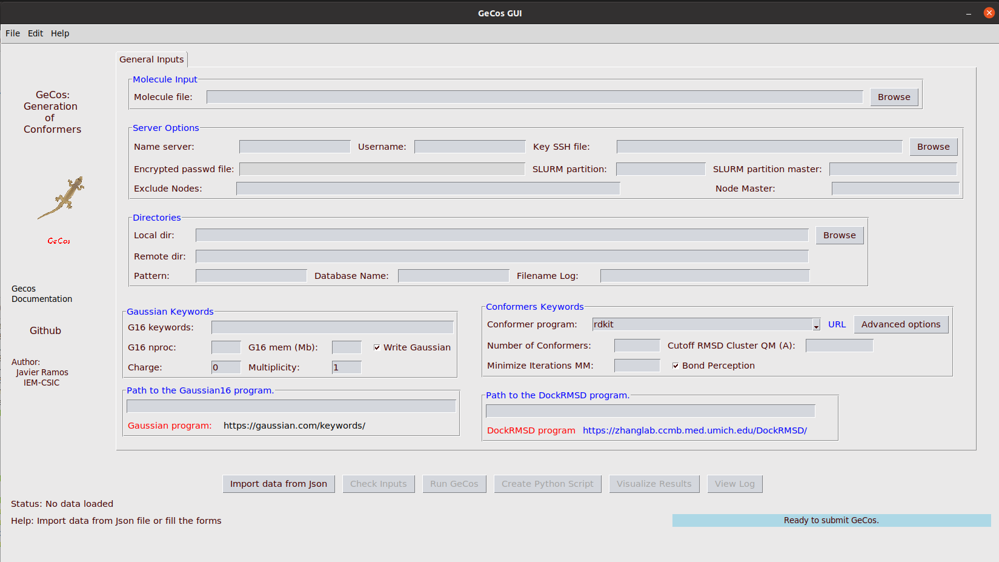

# Installation guide

The **``Gecos``** toolkit is implemented in Python. This toolkit has some dependencies on other Python packages such as:

* [MDAnalysis](https://www.mdanalysis.org/) 
* [Rdkit](https://www.rdkit.org/) 
* [Indigox](https://github.com/allison-group/indigox) 
* [Openbabel](http://openbabel.org/wiki/Main_Page)
(...)

The complete list of dependencies can be found in the files **[requirements.txt](../requirements.txt)** and **[setup.py](../setup.py)**.

These dependencies are managed by the **setup.py** script and should be installed automatically after these steps. However, a few programmes need to be installed manually (see section Pre-installation)

-------------------

## Pre-installation

-------------------

Before you can install, some software must be installed on your system. The installation of the software via the Ubuntu package archive is given in brackets, for other distributions please read their documentation.

* `git` (sudo apt-get install git)
* `python3-venv` (sudo apt update; sudo apt-get install python3-venv)
* `python3-dev` (sudo apt-get install python3-dev python-dev)
* `python3-tk` (sudo apt-get install python3-tk)
* `swig` (sudo apt-get install swig)

-------------------

## Create a virtualenv environment 

-------------------
It is highly recommended to create a virtual environment. This is a Python environment in which the Python interpreter, the libraries and scripts installed in it are isolated from those in other virtual environments and (by default) from any libraries installed in a "system" Python.

First we create an isolated Python environment to install the necessary packages (see dependencies below). Then activate the virtual environment.

```bash
python3 -m venv <name_of_env>
source <name_of_env>/bin/activate
pip list
pip install --upgrade pip
```

**``WARNING:``** This virtual environment **must** be activated in order to use the software.

Example:

```bash
ubuntu@ubuntu2004:~$ python3 -m venv sandbox_gecos
ubuntu@ubuntu2004:~$ source sandbox_gecos/bin/activate
(sandbox_gecos) ubuntu@ubuntu2004:~$ pip list
Package       Version
------------- -------
pip           22.0.4
pkg_resources 0.0.0
setuptools    44.0.0
(sandbox_gecos) ubuntu@ubuntu2004:~$
(sandbox_gecos) ubuntu@ubuntu2004:~$ deactivate
ubuntu@ubuntu2004:~$ 
```

Note that the python environment is activated, (sandbox_gecos) before the linux prompt. The environment can be deactivated with the command **deactivate**.

-------------------

## Clone the github repository and install Gecos

-------------------
If the Python virtual environment is activated, clone and install the desired Python libraries.

```bash
git clone https://github.com/jrdcasa/gecos.git
cd gecos
python -m pip install wheel
python setup.py install 
```

If the installation is correct, you should see the following message:

```bash
(...)
Installed /home/ubuntu/sandbox_gecos/lib/python3.8/site-packages/gecos-0.1-py3.8.egg
Processing dependencies for gecos==0.1
Finished processing dependencies for gecos==0.1

    Installation Done!!!! at 16/03/2022 11:09:06
```

An **install.log** file should be created with information about the installation process.

-------------------

## Run Gecos

-------------------
You can start GeCos from the command line as follows:

```bash
(sandbox_gecos) ubuntu@ubuntu2004:~/gecos$ gecos
usage: gecos [-h] (-j JSON_FILE | -p PYTHON_FILE)
gecos: error: one of the arguments -j/--json -p/--python is required
(sandbox_gecos) ubuntu@ubuntu2004:~/gecos$ 
```

You can also use a graphical user interface to run GeCos:

```bash
(sandbox_gecos) ubuntu@ubuntu2004:~/gecos$ gecos_gui
```

<p align="center">
    
</p>
