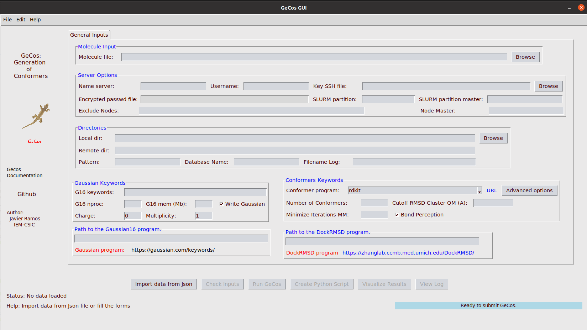

Setup GeCos with the Graphical User Interface (GUI)
==============

---------------------------
#### Preparation of the initial structure
---------------------------

In this example, **ethylene vinyl alcohol** (EVOH) oligomers are prepared with  [GeCoS](https://github.com/jrdcasa/gecos). The monomer for this oligomer is shown in Figure 1. 


<p>
    
    <p style="margin-left:18em;font-size: 18px;font-weight:bold">Figure 1: Chemical structure used in this calculation</p>
</p>


The initial structure for the EVOH model was created using Gaussview. Two files were created,  a [pdb](files/Model01_EVOH.pdb) and the input file for [gaussian](files/Model01_EVOH.gjf). Then, the structure was optimised at the M062X/6-31G** level ([J.Comp.Chem 2013, 34(2), 121-31](https://onlinelibrary.wiley.com/doi/10.1002/jcc.23112)). The calculation was performed in a cluster with Gaussian16 installed.

Table 1 contains the files from the optimisation process.

| System | Gaussian Input | Gaussian Output   | Optimised PDB |
|---|---|---|---|
|  Model01_EVOH |   [gaussian input](files/Model01_EVOH.gjf) |   [gaussian log](files/Model01_EVOH.log)|   [gaussian opt](files/Model01_EVOH_opt.pdb)| 


---------------------------
#### Setup GeCos calculation
---------------------------

Open the GUI for Gecos:

```
ubuntu@ubuntu2004:~$ source sandbox_gecos/bin/activate
(sandbox_gecos) ubuntu@ubuntu2004:~/gecos$ gecos_gui
```

<p align="center">
    
</p>

1. Browse your directory and find the optimised pdb for the EVOH model and paste it into the Molecule file field.

2. Now, we need to setup all fields for the server where the calculations of QM will be done. The name server can be an IP or a cluster name for remote servers as well as localhost if you want to do the QM calculations on the local server.
3.  Define the **local directory** where the local files should be stored. Then, create a **remote directory** in the remote machine. Both directories must exist before to launch the calculations. **Pattern** is the string to be used as seed for naming the files created in the calculation (i.e. 01-Model_EVOH). **Database** name for the SQL database (i.e. 01-Model_EVOH.db). Finally, **Filename log** is the name of the output file in which the calculations are summarised.
4. Then, you define the keywords that refer to the Gaussian calculations.
5. Finally, fill in the Conformers keywords with the appropiate information. 
	
	
	
	
	
	
	
	
	
	
	
	
	
	
	
	
	
	
	
	
	
	
	
	
